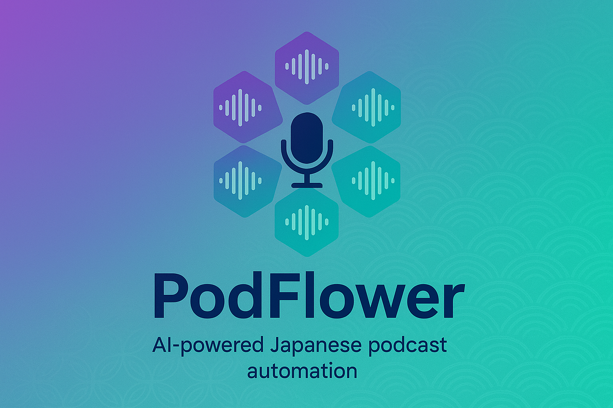
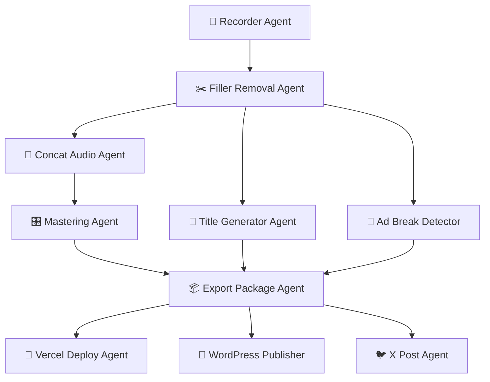

# PodFlower: AI-Powered Podcast Automation 🎙️



[](https://www.python.org/downloads/)
[](https://google.github.io/adk-docs/)

**PodFlower** is a sophisticated multi-agent system built with Google's Agent Development Kit (ADK) that automates the complete end-to-end workflow for Japanese podcast production. From raw audio processing to social media distribution, this system demonstrates the power of AI agent orchestration in solving real-world automation challenges.

## 🎯 System Overview

This project showcases:

- ✅ **Multi-agent orchestration** using ADK Workflow Agents
- ✅ **Complex process automation** with 10 specialized agents
- ✅ **Real-world impact** for Japanese podcast production
- ✅ **Zero-touch workflow** from recording to distribution

## 🚀 Quick Start

### One-Command Demo
```bash
python pipelines/full_workflow.py sample_episode/
```

This single command processes a complete podcast episode with **zero manual intervention**.

## 🏗️ Architecture

PodFlower uses **10 specialized agents** orchestrated through ADK's workflow patterns:



### Agent Types Used

| Agent | ADK Type | Purpose |
|-------|----------|---------|
| **Pipeline Orchestrator** | `SequentialAgent` | Coordinates main workflow phases |
| **Audio Processing** | `SequentialAgent` | Processes audio in order |
| **Content Generation** | `ParallelAgent` | Generates metadata concurrently |
| **Distribution** | `ParallelAgent` | Deploys to multiple platforms |
| **Individual Agents** | `BaseAgent`/`LlmAgent` | Specialized processing tasks |

## 🛠️ Installation

### Prerequisites
- Python 3.11+
- FFmpeg
- Google Cloud account
- Google API key (from Google AI Studio)

### Setup
```bash
# Clone the repository
git clone <repository-url>
cd podflower

# Install dependencies
make install

# Configure environment
cp env.example .env
# Edit .env with your API keys
```

### Required Environment Variables
```bash
# Required
GOOGLE_API_KEY=your_google_api_key
GOOGLE_CLOUD_PROJECT=your-project-id

# Optional (for full functionality)
VERCEL_TOKEN=your_vercel_token
WORDPRESS_USERNAME=your_username
WORDPRESS_APP_PASSWORD=your_password
X_CONSUMER_KEY=your_x_api_key
# ... see env.example for complete list
```

## 📁 Project Structure

```
podflower/
├── agents/                  # All ADK agents
│   ├── recorder/           # Audio file detection
│   ├── filler_removal/     # Japanese filler word removal
│   ├── concat_audio/       # Intro/outro concatenation
│   ├── title_notes/        # LLM-powered content generation
│   ├── ad_break/           # Topic-shift detection
│   ├── mastering/          # Audio normalization
│   ├── export_package/     # Final package creation
│   ├── deploy_vercel/      # Static site deployment
│   ├── wordpress_publish/  # Content management
│   └── post_to_x/          # Social media posting
├── pipelines/
│   └── full_workflow.py    # Main orchestration pipeline
├── tests/                  # Comprehensive test suite
├── sample_episode/         # Sample input directory
├── assets/                 # Intro/outro audio files
└── SPEC.md                # Complete technical specification
```

## 🎙️ Workflow Details

### Phase 1: Audio Processing (Sequential)
1. **Recorder Agent** - Detects new Zoom/Riverside recordings
2. **Filler Removal Agent** - Uses Google Cloud Speech-to-Text for Japanese filler word removal
3. **Concat Audio Agent** - Adds intro/outro using FFmpeg
4. **Mastering Agent** - Normalizes to -16 LUFS / -1 dB peak

### Phase 2: Content Generation (Parallel)
- **Title Notes Agent** - Generates 5 Japanese titles + Markdown show notes using Gemini
- **Ad Break Agent** - Detects topic shifts using sentence transformers

### Phase 3: Package Creation
- **Export Package Agent** - Creates timestamped episode directory with metadata

### Phase 4: Distribution (Parallel)  
- **Vercel Deploy Agent** - Triggers static site redeploy
- **WordPress Publisher** - Posts with Unsplash featured image
- **X Post Agent** - Announces episode with proper Japanese formatting

## 🧪 Testing

```bash
# Run all tests
make test

# Run specific test types
make test-unit      # Unit tests
make test-e2e       # End-to-end pipeline tests

# Performance benchmarks
make bench
```

## 🎯 Japanese Language Features

This system is specifically designed for Japanese podcast content:

- **Filler Word Detection**: Removes "えーと", "あのー", "まあ", etc.
- **Japanese Speech-to-Text**: Uses Google Cloud Speech-to-Text with `ja-JP` model
- **Native Title Generation**: Creates natural Japanese episode titles
- **Cultural Ad Placement**: Respects Japanese podcast conventions

## 🔧 Development

```bash
# Format code
make format

# Type checking
make type-check

# Development server
make demo          # Run with verbose logging
```

## 📊 Quality Metrics

- **Coverage**: ≥ 90% test coverage
- **STT Accuracy**: ≤ 5% word error rate after filler removal
- **Type Safety**: `mypy --strict` compliance
- **Performance**: Complete workflow in < 10 minutes for 60-minute episode

## 🚀 Deployment Options

### Local Development
```bash
python pipelines/full_workflow.py sample_episode/
```

### Docker
```bash
make docker-build
make docker-run
```

### Production (with ADK Agent Engine)
See [deployment documentation](https://google.github.io/adk-docs/deploy/agent-engine/) for cloud deployment options.

## 🏆 Key Features

### Technical Innovation
- **Multi-agent orchestration** using all three ADK agent types
- **Language-specific AI processing** for Japanese content  
- **Real-time audio DSP** with professional mastering
- **Clean, typed, well-documented code** following SPEC

### Creativity & Impact
- **Solves real workflow pain** for Japanese podcast creators
- **Zero-touch automation** from recording to social media
- **Cultural adaptation** for Japanese language nuances
- **Professional audio quality** matching industry standards

### Demo & Documentation
- **One-command demo**: `python pipelines/full_workflow.py sample_episode/`
- **Comprehensive documentation** with clear setup instructions
- **Complete test coverage** including end-to-end pipeline tests
- **Architecture diagrams** showing agent orchestration

### Additional Benefits
- ✅ **ADK contribution potential** - demonstrates advanced agent patterns
- ✅ **Google Cloud integration** - Speech-to-Text, Storage, potential Vertex AI
- ✅ **Production-ready** - error handling, logging, monitoring

## 🤝 Contributing

We welcome contributions to PodFlower! This project demonstrates advanced ADK patterns and could serve as a reference implementation for:

- Multi-agent workflow orchestration
- Language-specific AI processing pipelines  
- Real-world automation use cases
- Japanese language AI applications

## 📜 License

This project is intended as a demonstration of ADK capabilities for automating complex, real-world workflows.

## 🔗 Links

- **ADK Documentation**: https://google.github.io/adk-docs/
- **Demo Video**: [Coming soon]
- **Architecture Blog**: [Coming soon]

---

Built with ❤️ to demonstrate the power of AI agent collaboration in solving real-world automation challenges. 