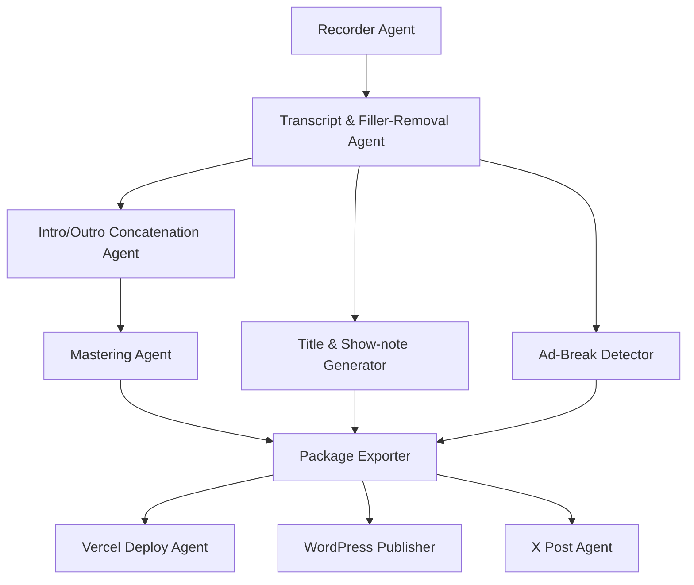

# PodFlower: Specification (v0.1)

**Status:** Draft — ready for coding in Cursor IDE using *claude‑4‑sonnet MAX* code‑gen.

---

## 1  Purpose

Automate the end‑to‑end workflow for the Japanese podcast **momit.fm** and its companion web media **momithub**.  The system is built with the **Google ADK (AI Development Kit)** and demonstrates multi‑agent orchestration that solves language‑specific gaps (Japanese filler‑word removal, APAC localization) while integrating external services (Zoom/Riverside, Vercel, X/Twitter, WordPress).

Success criteria

* **One‑command demo**: `python pipelines/full_workflow.py sample_episode/`
* All stages complete with *zero* manual touch up to the final Art19 upload step.
* Output quality ≥ human baseline (see §8 Tests).

---

## 2  High‑Level Pipeline
### 2.1  ADK Agent Families

ADK defines three complementary agent families:
* **LLM Agents** – focus on language reasoning and tool invocation using large language models.  
* **Workflow Agents** – deterministic controllers that orchestrate other agents.  ADK provides three built‑ins:  
  * `SequentialAgent` – run sub‑agents in order  
  * `ParallelAgent`   – fan‑out sub‑agents in parallel  
  * `LoopAgent`       – repeat execution until a stop condition  
* **Custom Agents** – direct subclasses of `BaseAgent` that encapsulate any bespoke logic (API calls, DSP, etc.) that doesn’t fit the other two families.

**PodFlower agent mapping**
| Agent folder          | Primary role                              | ADK family  |
|-----------------------|-------------------------------------------|-------------|
| `recorder`           | Watch folder / poll raw tracks            | LoopAgent   |
| `filler_removal`     | STT + cut Japanese filler words           | Custom Agent|
| `concat_audio`       | Prepend/append intro & outro               | Custom Agent|
| `title_notes`        | Generate JP titles & show notes           | LLM Agent   |
| `ad_break`           | Detect topic‑shift ad points              | Custom Agent|
| `mastering`          | Loudness & peak normalization             | Custom Agent|
| `export_package`     | Bundle final audio + metadata             | Custom Agent|
| `deploy_vercel`      | Trigger static‑site redeploy              | Custom Agent|
| `wordpress_publish`  | Publish article to WordPress              | Custom Agent|
| `post_to_x`          | Post announcement tweet                   | Custom Agent|



---

## 3  Repository Layout

```
podflower/
│  README.md
│  SPEC.md          ← (this file — do not edit via code‑gen)
│  requirements.txt
│  Makefile
│
├─ agents/
│   ├─ recorder/
│   │   └─ recorder.py
│   ├─ filler_removal/
│   │   └─ filler_removal.py
│   ├─ concat_audio/
│   │   └─ concat_audio.py
│   ├─ title_notes/
│   │   └─ title_notes.py
│   ├─ ad_break/
│   │   └─ ad_break.py
│   ├─ mastering/
│   │   └─ mastering.py
│   ├─ export_package/
│   │   └─ export_package.py
│   ├─ deploy_vercel/
│   │   └─ deploy_vercel.py
│   ├─ post_to_x/
│   │   └─ post_to_x.py
│   └─ wordpress_publish/
│       └─ wordpress_publish.py
│
├─ pipelines/
│   └─ full_workflow.py
│
├─ tests/
│   ├─ test_pipeline.py
│   └─ ...
└─ sample_episode/
    ├─ raw_audio.mp4
    └─ guest_track.mp4
```

> **Cursor Hint:** Each module in `agents/` exposes a single class named `Agent` that subclasses `adk.agent.BaseAgent`.

---

## 4  Agent Interface Contract

All agents **must** implement:

```python
class Agent(BaseAgent):
    """Agent <name> — see SPEC.md for full contract."""

    # Required meta fields
    name = "<unique‑snake‑case>"
    description = "<1‑sentence>"
    version = "0.1.0"

    async def run(self, state: dict) -> dict:  # may be sync if CPU‑bound
        """Mutates and/or returns new state keys.

        Args:
            state (dict):
                Input/Output shared pipeline state.

        Returns:
            dict: Updated slice to merge back into global state.
        """
```

### Shared State Keys

| Key                   | Type        | Producer       | Consumer         |
| --------------------- | ----------- | -------------- | ---------------- |
| `audio_raw_paths`     | `list[str]` | Recorder       | Filler‑Removal   |
| `transcript`          | `str`       | Filler‑Removal | downstream       |
| `audio_clean_path`    | `str`       | Filler‑Removal | Concat, Ad‑Break |
| `title_candidates`    | `list[str]` | Title/Notes    | Package Export   |
| `shownote_md`         | `str`       | Title/Notes    | Package Export   |
| `ad_timestamps`       | `list[str]` | Ad‑Break       | Package Export   |
| `episode_package_dir` | `str`       | Export Package | Deploy, WP, X    |

Agents **must not** invent new top‑level keys; extend `state["extras"]` (dict) for experimentals.

---

## 5  Functional Specs per Agent

### 5.1  Recorder Agent (`agents/recorder/recorder.py`)

* **Trigger:** CLI arg `--watch {PATH}` or webhook.
* **Input:** directory containing Zoom or Riverside raw tracks.
* **Output:** `audio_raw_paths` list written to state.

### 5.2  Filler‑Removal Agent

* Use *Google Cloud Speech‑to‑Text v2* with `language_code="ja-JP"`.
* Identify filler tokens: `{"えーと", "あのー", "まあ", "その", "なんか"}` (list is configurable via YAML).
* Generate `cut_list.json` (ffmpeg `[start,end]` pairs) and apply with ffmpeg.
* Return `audio_clean_path` and full `transcript`.

### 5.3  Concat Audio Agent

* Prepend `assets/intro.mp3`, append `assets/outro.mp3` using ffmpeg concat demuxer.
* Fail if either asset missing.

### 5.4  Title & Show‑note Generator

* Prompt LLM (claude‑4‑sonnet) with system + few‑shot examples.
* Produce exactly **5** title suggestions and a markdown show‑note obeying this schema:

  ```json
  {
    "title_candidates": ["..."]*,
    "shownote_md": "# 概要\n..."
  }
  ```
* Validate schema before returning.

### 5.5  Ad‑Break Detector

* Use `sentence-transformers/paraphrase-multilingual-MiniLM-L12-v2` embeddings.
* Compute cosine similarity between consecutive 30‑second windows; flag drop‑offs > 0.3.
* Enforce rule: earliest ad ≥ 00:10:00, latest ≤ 00:45:00.

### 5.6  Mastering Agent

* Normalise loudness to `-16 LUFS` and peak to `-1 dB` (ffmpeg `loudnorm`).

### 5.7  Export Package Agent

* Create folder: `build/{YYYYMMDD_episodeNN}/` containing:

  * `episode_final.mp3`
  * `shownote.md`
  * `meta.json` (selected title, ad points, duration, SHA256 checksum)

### 5.8  Deploy Vercel Agent

* Run `vercel deploy --prod` in `hub.momit.fm` repo (assumes token env var `VERCEL_TOKEN`).

### 5.9  WordPress Publisher Agent

* Use WordPress REST; post shownote with `eyecatch_url` from Unsplash API (query by title).

### 5.10  X Post Agent

* Compose post:

  ```
  新しいエピソード公開🎙️\n{title} #momitfm\n{episode_url}
  ```
* Call v2 endpoint with OAuth2 Bearer token.

---

## 6  Environment & Installation

```bash
# System deps
sudo apt-get update && sudo apt-get install -y ffmpeg

# Python
pyenv install 3.11.9
pyenv local 3.11.9
python -m venv .venv
source .venv/bin/activate
pip install -r requirements.txt
```

`requirements.txt` should pin:

```
adk==0.4.3
openai
anthropic
faster-whisper
sentence-transformers
python-dotenv
```

Secrets via `.env` (not committed).

---

## 7  Coding Guidelines

1. **Black + Ruff**: run `make format` before commit.
2. Type annotations everywhere; `mypy --strict` passes.
3. Use `asyncio` if external I/O > 100 ms.
4. Raise `AgentError` (custom) for recoverable faults; let pipeline halt on fatal.
5. Log with `structlog`; redact PII.

Cursor‑specific lint snippet (paste in `.cursorconfig`):

```json
{
  "model": "claude-4-sonnet",
  "mode": "MAX",
  "blockLargeDiff": true,
  "tabSize": 4
}
```

---

## 8  Tests & Benchmarks

* **Unit tests**: pytest per agent (mock GCP, X API). Coverage ≥ 90%.
* **E2E smoke**: `tests/test_pipeline.py` loads sample\_episode, asserts `episode_package_dir` exists.
* **Quality metric**: STT word error rate after filler removal ≤ 5% vs baseline.

Run:

```bash
make test          # runs unit + e2e
make bench         # prints WER & runtime table
```

---

## 9  Future Extensions (non‑MVP)

* Art19 uploader (once API available)
* Multi‑lingual filler models (Thai, Vietnamese, Korean)
* Real‑time Riverside webhook to auto‑trigger pipeline

---

### END OF SPEC

*Do not modify this SPEC.md via code‑gen. All code must conform to the contracts above.*
